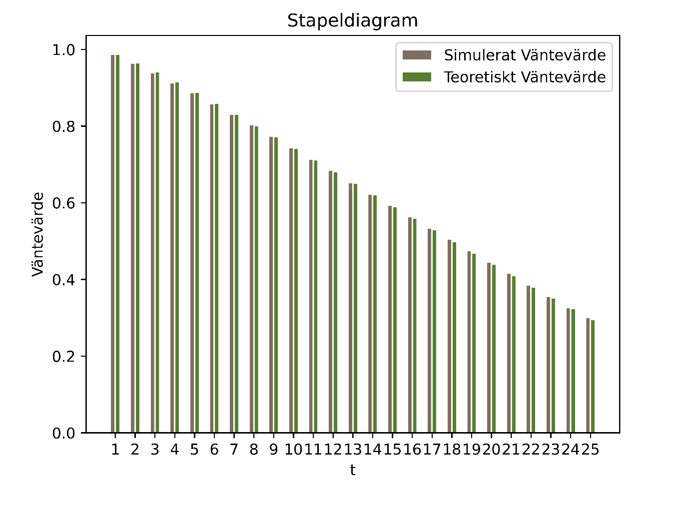
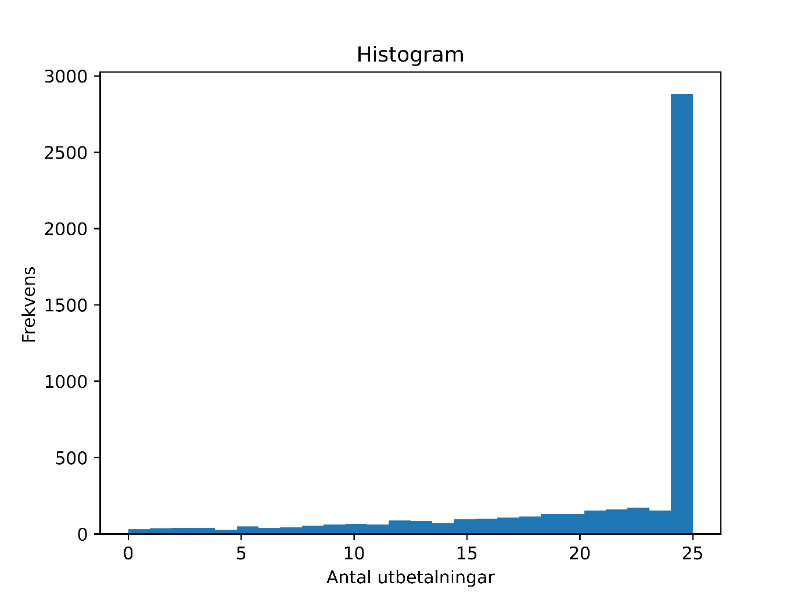
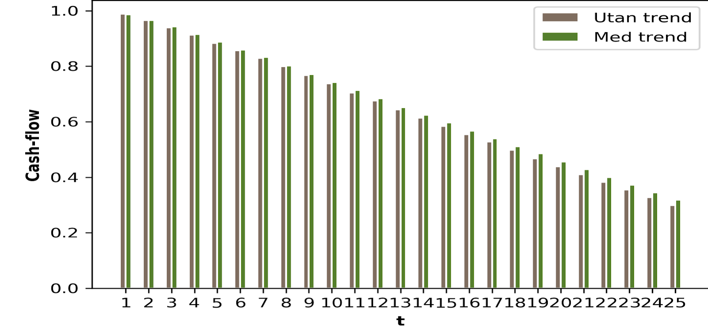
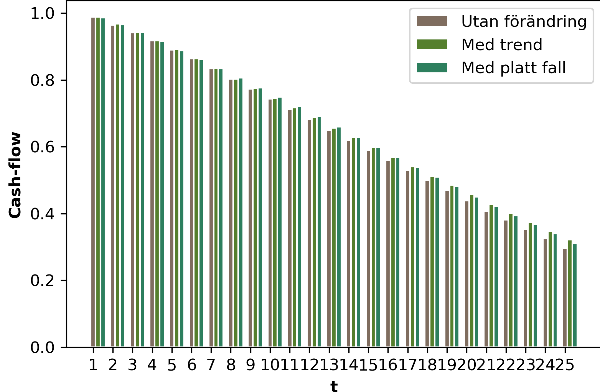
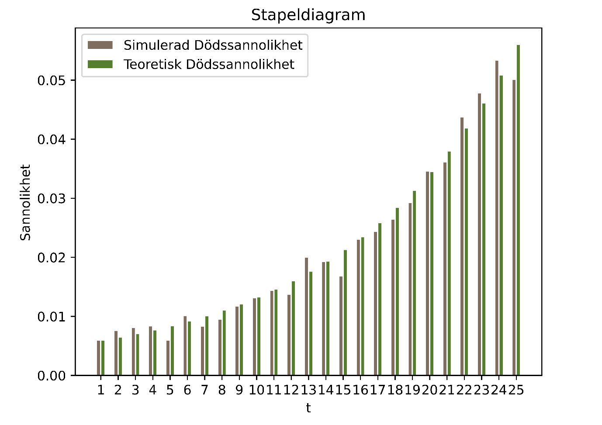
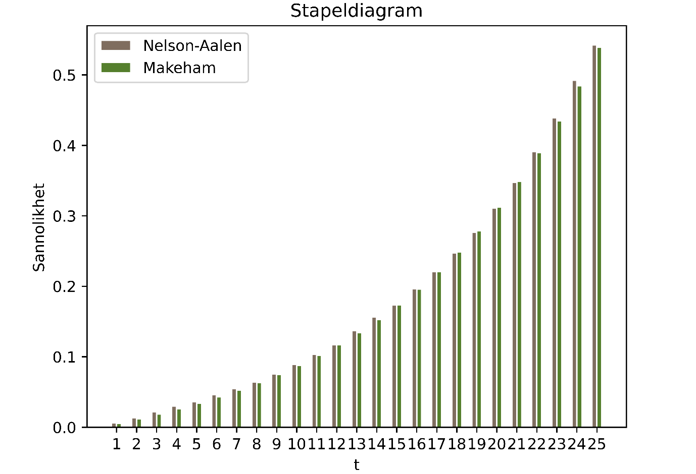

Project 1 - Life Insurance
================
Willie Langenberg & Adam Goran
2020-05-14

Consider a directly starting annuity which pays 1 unit of money at the
end of each year for as long as the insured is alive and is between 65
and 90 years old (first payment if reaching age 66). In the separate
text files interest.txt and life table.txt you are given continuously
compounded spot rates and a life table, respectively. Carry out the
following analyses using interest.txt and life table.txt:

## Uppgift 1

Simulate 5 000 i.i.d. annuities according to the above described
contract for a today 65 year old individual and • compare the simulated
expected values with the theoretical expected values, both in total and
for payments in different time periods,  
• analyse the simulated distribution of total future payments w.r.t.
variance, quantiles etc,  
• analyse the dependence between future payments

### Solution:

Med hjälp av ”life\_table.txt” och ”interest.txt” simulerade vi 5000
oberoende och likafördelade annuitetskontrakt för en idag 65 år gammal
individ. Varje kontrakt är simulerad enligt en binomial fördelning med
parametern p från qx i life\_table för respektive ålder t. Dessa
kontrakt simulerar vi då 5000 gånger och sparar all data i en Pandas
DataFrame. Vi ser nedan i Figur 1.1 det simulerade och teoretiska
väntevärdet i olika tidsperioder.

 *Figur 1.1: Stapeldiagram för
väntevärdet av diskonterade utbetalningar i olika tidsperioder t+65.*

Det simulerade väntevärdet för totala utbetalningar blev efter
diskontering och avrundning 16,28. Det teoretiska väntevärdet, beräknat
direkt ur ”life\_table.txt” och diskontering från ”interest.txt”, blev
16,22. Att dessa är snarlika är positivt, eftersom det indikerar att
simuleringen gått rätt till. Observera att väntevärdet för de totala
utbetalningarna för teoretiska/simuleringen är lika med summan av
värdena på respektive staplar i Figur 1.1. Från simuleringen beräknade
vi även variansen av utbetalningarna mellan alla kontrakt till 19,04.
Detta beräknades då genom att ta kvadraten av differensen mellan varje
kontrakts utbetalning, och väntevärdet. Vi gjorde detta för alla 5000
kontrakt och tog medelvärdet av dessa. I simuleringen fick 2881 kontrakt
full betalning, dessa individer levde alltså fram till och med åldern
90. Efter diskontering beräknas denna fulla betalning till 18,85. Detta
betyder att 57.6% (2881/5000) fick full betalning, alltså är detta även
medianen. Vi kan se hur denna fördelningen såg ut i Figur 1.2 nedan:

 *Figur 1.2: Histogram för frekvensen
kontrakt som har ett antal utbetalningar 0-25, utan diskontering.*

I Figur 1.2 ser vi som sagt, att en betydande andel av kontrakten fick
full betalning. Givet fördelningen vi ser i Figur 1.2 verkar variansen
vara rimlig, eftersom de flesta värdena avviker från väntevärdet. Vi
beräknade 5%-kvantilen till 5,69 och den första kvartilen till 15,46.
För att se fördelningen för det diskonterade värdet av utbetalningarna
byter vi endast gradering/skala på xaxeln. Värdet eller höjden på
histogrammet är självklart densamma, medan utbetalningar exempelvis 25
blir 18,85 efter diskontering och 6 blir 5,69 och så vidare.

Det är svårt att komma fram till någon tydlig slutsats gällande
beroendet mellan framtida betalningar, eftersom beroendet har olika
styrkor för olika år. Till exempel gäller det att $ P(C\_2=1)
P(C\_2=1|C\_1=1) $ medan \(P(C_{25}=1)\approx0.56\) och
\(P(C_{25}=1|C_{24}=1)\approx0.95 .\)

Med andra ord gäller det att beroendet blir starkare med tiden när vi
tittar på sannolikheter. Anledningen till detta är att sannolikheten att
dö inom ett år är låg medan sannolikheten att dö över flera år blir
större. Däremot finns det alltid något slags beroende mellan alla
framtida betalningar. Det finns exempelvis en chans att en person dör
tidigt och då är sannolikheten till framtida utbetalningar 0. Baserat på
reflektionerna ovan kan man tänka sig att en korrelationskoefficient
mellan betalningen ett år och betalningen nästa år är positiv för alla
år men inte linjär över alla år. Den kanske snarare växer exponentiellt
eller kvadratiskt så att senare år har en större
korrelationskoefficient. Sammantaget har vi kommit fram till rimliga
resultat då följden av framtida utbetalningar är beroende variabler.

## Uppgift 2

Simulate 5 000 independent annuities according to the above described
contract for a today 65 year old individual

• when introducing a relative decreasing trend of 1 % in the mortality
rates and compare the expected cash-flow and the variance of the total
payments made with the results from (i), i.e. if we let A(t) denote the
cumulative intensity function, we let  
(A(x + t) − A(x + t − 1))trend = (1 − 0.01)t(A(x + t) − A(x + t − 1)),

• when introducing a relative decrease of s % across all mortality rates
and compare the expected cash-flow and the variance of the total
payments made with the results from (i) and the previous step, i.e. 
(A(x + t) − A(x + t − 1))flat = (1 − s/100)(A(x + t) − A(x + t − 1)),  
where s is chosen so that the E\[Lflat\] = E\[Ltrend\], where E\[Lflat\]
and E\[Ltrend\] corresponds to the expected discounted liabilities when
using a flat stress and a trend stress, respectively,

• when introducing a relative decrease in the spot rates of s % the spot
rates are decreased and compare the expected cash-flow and the variance
of the total payments made with the results from (i) and the previous
steps, i.e. rt,spot = (1 − s/100)rt, where s is chosen so that the
E\[Lspot\] = E\[Ltrend\], defined analogously as for the other stresses.

### Solution:

För att lösa uppgiften använder vi definitionen av qx och byter sedan
variabler från S(x) till A(x). Därefter kan vi lösa ut A(x+1)-A(x) och
multiplicera med trenden såsom den beskrivs i uppgiften.Till sist löser
vi ut qx och får nya ett-års döds sannolikheter. En snabb jämförelse med
de gamla döds sannolikheterna ger exempelvis att sannolikheten att en
slumpvis vald person dör någon gång under åren 65 till 90 sjunker från
cirka 44% till cirka 38%. Vi undersöker nu förväntat cash-flow jämfört
med simuleringen från uppgift 1.

 *Figur 2.1: förväntat cash-flow med och
utan döds trend.*

Vi ser i Figur 2.1 att trenden gör sitt avtryck på de förväntade
utbetalningarna. De första åren har den inte så stor påverkan, vilket
beror på att döda sannolikheterna redan är låga. De sista åren syns
däremot en tydlig skillnad, även om diskonteringen tar bort en stor del
av effekten. Vi får att det diskonterade väntevärdet för ett kontrakt
stiger från ungefär 16,2 till ungefär 16,44 jämfört med simuleringarna
från uppgift 1, vilket är en direkt konsekvens av de lägre döds
sannolikheterna. Variansen för den totala skulden per kontrakt är något
lägre på 18.67. Anledningen till detta skulle kunna vara slumpen men kan
också vara att en högre genomsnittsålder ökar diskonteringens betydelse
och därmed sänker variansen.

Vi går vidare till nästa punkt där vi skall undersöka ett platt fall i
dödssannolikheterna istället för en trend. Förfarandet med att lösa
uppgiften är exakt lika som tidigare, med skillnaden att alla ett-års
döds sannolikheter minskas lika mycket. Genom att testa olika värden på
s fick vi att värdet 10,5 i princip gav samma väntevärde som tidigare.
Vi undersöker det förväntade cash-flowet som simuleringen gav upphov
till i ett diagram.

 *Figur 2.2: jämförelse av cash-flow*

I Figur 2.2 är det den tredje stapeln, som visar cash-flowet för
simuleringen med ett platt fall i döds sannolikheterna, som är ny
jämfört med Figur 2.1. Vi ser ett förväntat resultat, där den tredje
stapeln är tydligt högre från år 8 till år 13. Att den tredje stapeln
inte är högre än de andra de första åren beror på att döds sannolikheten
redan är så pass låg, då spelar slumpen en större roll. Från ungefär
mitten och framåt, alltså från år 12, är döds sannolikheterna lägre för
simuleringen med trenden, vilket syns i Figuren. Variansen för denna
simulering blev 17,63, vilket är lägre än simuleringen med trend och
blev även lägre vid upprepade simuleringar. Detta kan bero på att
sannolikheten för extrema observationer, till exempel att en person dör
under de första eller sista åren, är lägre i det här fallet.

Nu går vi vidare till den tredje punkten där vi skall betrakta ett fall
i spot rates som påverkar diskonteringen. Vi kommer nu att använda de
vanliga döds sannolikheterna som återfinns i tabellen. Värdet på s som
ger ungefär samma väntevärde som tidigare är 6,36. Resultatet av
simuleringen syns nedan i figur 2.3, där den tredje stapeln visar det vi
nu vill undersöka. Vi ser att diskonteringen har fortsatt låg betydelse
de första åren medan effekten tilltar framåt år 12. De andra staplarna
kommer däremot ikapp mot slutet, vilket antyder att diskonteringens
betydelse överträffas av betydelsen för de lägre döds sannolikheterna
mot slutet. Variansen för ett kontrakts totala värde blev i detta fall
relativt hög på 20,93 och var även hög vid upprepade simuleringar. Det
gäller att ungefär 50% av kontrakten löper tiden ut och alla dessa
kontrakt får ett större värde med den lägre diskonteringen, vilket
bidrar till större varians. Sannolikheten att dö tidigt är även större
här jämfört med de två tidigare simuleringarna.

 *Figur 2.3: ny jämförelse av cash-flows*

## Uppgift 3

Based on the simulations from (i)  
• estimate the one year death probabilities and compare with the true
ones from life table.txt.  
• Re-calculate the expected cash-flow and the variance of the total
payments and compare with the results from (i).  
• Determine 95% confidence intervals of your estimated one year death
probabilities and analyse how much the expected total future payments
change if you use the lower limit of these (point wise) confidence
intervals.  
• calculate the Nelson-Aalen estimator of the cumulative mortality rate
and compare with the following Makeham function:  
α(t) = a + b10c(t−6), t ≥ 0,  
where a = 0.001, b = 0.000012 and c = 0.044 (Swedish “M90”).  
• use the Nelson-Aalen estimates from the previous step and compare with
life table.txt.

### Solution:

Vi återanvände simuleringar gjorda i uppgift (i), där vi simulerat 5000
kontrakt. Vi estimerar ett-års dödssannolikheterna för åldrarna 65-90 i
Figur 3.1.

 *Figur 3.1: Stapeldiagram för ett-års
dödssannolikheten för vår simulerade data och data från
”life\_table.txt”. Vi ser dödssannolikheten på y-axeln, för åldrar
t+65 på x-axeln.*

Som förväntat finns det små skillnader mellan de simulerade och de
teoretiska dödssannolikheterna, men de är i stort sett likadana. Detta
beror självklart på att den simulerade tabellen kommer från den
teoretiska livstabellen, vilket betyder att den vid fler simulerade
kontrakt skulle gå mot samma sannolikheter (enligt stora talens lag).

Från den simulerade tabellen med 5000 kontrakt kan vi efter diskontering
återigen beräkna det förväntade värdet av totala utbetalningar till
16,28 och variansen till 19,04.

Vi estimerade även ett-års dödsannolikheterna med ett
95%-konfidensintervall. Vi valde den nedre begränsningen i intervallet
och kunde därefter beräkna väntevärdet av de diskonterade
utbetalningarna till 16,82. Detta verkar rimligt eftersom, om vi
underskattar dödssannolikheterna kommer fler överleva längre och därmed
få mer utbetalningar, vilket ökar väntevärdet.

Vi beräknade sedan Nelson-Aalen estimatorn av den ackumulerade
dödligheten samt jämförde den med följande Makeham funktion:

𝛼(𝑡) = 𝛼 + 𝑏10𝑐(𝑡−6), 𝑡 ≥ 0,

där 𝛼 = 0,001, 𝑏 = 0,000012 och 𝑐 = 0,044. Vi har sedan integrerat
Makeham funktionen för att enklare kunna jämföra dem. Vi jämför dessa
två i ännu ett stapeldiagram nedan i Figur 3.2.

 *Figur 3.2: Stapeldiagram med två olika
estimat för ackumulerad dödlighet. Ett mått på andelen som dör inom en
tidsperiod 65+t.*

Vi ser i Figur 3.2 hur två olika funktioner estimerar den ackumulerade
dödligheten. Dessa estimat är väldigt lika med små skillnader för vissa
t. Nelson-Aalen estimatorn använder sig av data från simuleringen medan
Makeham funktionen använder tre paramtetrar som är baserad på
Livstabellen. Att dessa estimat är likadan är självklart en direkt
konsekvens av att båda använder information från samma livstabell.

Nedan i Figur 3.3 jämför vi även Nelson-Aalen estimatet med den faktiska
livstabellen. Vi har då integrerat qx kolumnen i livstabellen för att få
den ackumulerade dödligheten. Datan från livstabellen är något högre för
varje t, men fortfarande väldigt nära estimatets värden.

 *Figur 3.3: Stapeldiagram för
Nelson-Aalen estimatet samt den integrerade värdet av qx från
”life\_table.txt”.*

## Uppgift 4

Based on a portfolio of size 500 of i.i.d. contracts, simulate 5 000
times and  
• calculate the total single premium for the entire portfolio when you
use a safety loading corresponding to the 80 % percentile using  
π = E\[L\] + c sqrt(Var(L)),  
for some appropriate choice of c, where L corresponds to the total
(discounted) cost of all contracts,  
• determine the single premium for a single contract,  
• redo the two steps above when you increase the portfolio size to 5
000.

### Solution:

Vi utför simuleringar likt det vi gjorde i uppgift 1 med 500 kontrakt
5000 gånger och får att väntevärdet, eller genomsnittet, av kostnaden
för hela portföljen blir 8109,6. Standardavvikelsen för denna totala
kostnad blir cirka 97,7 och beräknades genom att använda att variansen
för alla kontrakt tillsammans är samma som summan av kontraktens
varianser. Sedan tar vi genomsnittet av varianserna för de 5000
simuleringarna. Om vi vill vara någorlunda säkra på att göra en vinst på
ungefär 80% av kontrakten använder vi percentilen som motsvarar 80% i
normalfördelningen, alltså blir värdet på c 0,84. Premien för hela
portföljen bör därmed sättas till 8191,6 när vi använder formeln från
uppgiften. Om vi istället vill beräkna premien för ett enskilt kontrakt
använder vi samma värde på c och att väntevärdet av ett kontrakt är
16,22. Sedan delar vi variansen för ett kontrakt med standardavvikelsen
för hela portföljen eftersom vi har i.i.d. kontrakt. Premien blir då
16,383 för ett kontrakt, vilket är ett påslag på ungefär 1% jämfört med
jämviktspriset.

Nu utökar vi portföljen till 5000 kontrakt och simulerar denna 5000
gånger. Med samma beräkningar och samma värde på c får vi att premien
för hela portföljen bör sättas till 81365. Anledningen till att premien
blir lägre än tio gånger så stor som innan är att standardavvikelsen
inte växer linjärt, vilket variansen gör. Premien för ett kontrakt blir
16,273, alltså lägre jämfört med tidigare och beror på den lägre
variansen. Prispåslaget jämfört med jämviktspriset sjunker till ungefär
0,3%. Det är uppenbart att priset på premien närmar sig jämviktspriset
då antalet kontrakt blir större. Vi får sammantaget att en tiodubbling
av antalet kontrakt sänker premien per kontrakt med knappt 0,7% i det
här fallet. Om det hade gått att applicera detta exempel på
verkligheten hade slutsatsen blivit att det vore fördelaktigt för
kunderna om alla valde samma försäkringsbolag.
