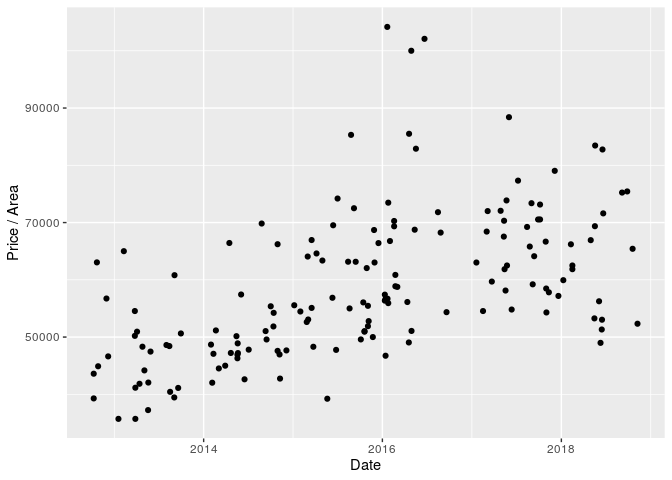
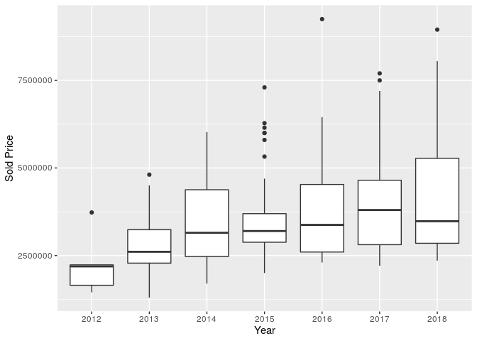
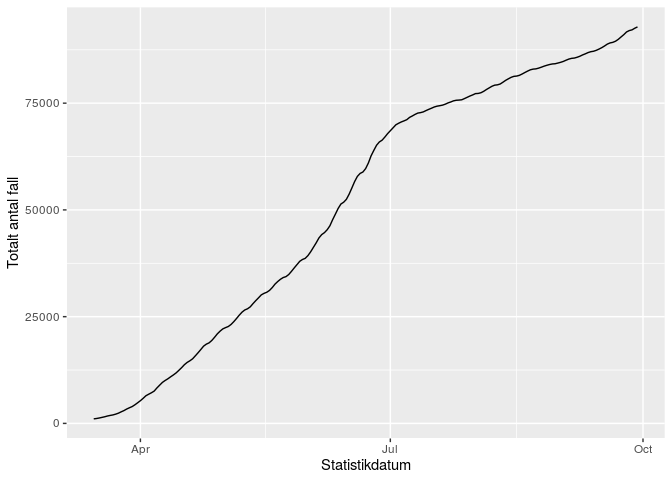
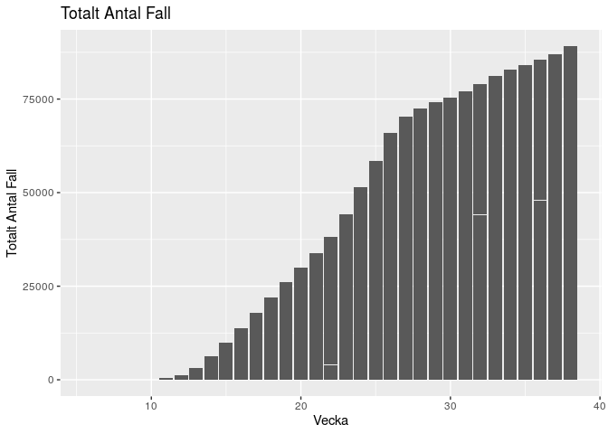
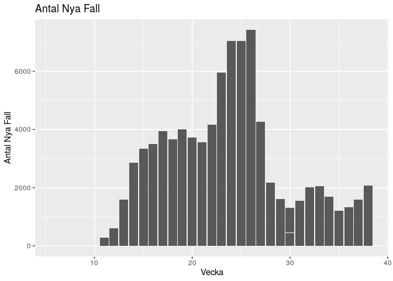

HW2
================
Willie Langenberg
2020-11-09

``` r
suppressMessages(library(tidyverse))
df <- read_csv('../HW_data/Booli_sold.csv', col_types = cols())
```

#### Exercise 1: Apartment prices

We start by illustrating the dependence between the sold price and
living area of each observation.

``` r
ggplot(df, aes(x = livingArea, y = soldPrice)) + 
  geom_point() + 
  expand_limits(y = 0) + 
  ylab("Sold Price") + 
  xlab("Living Area")
```


We now illustrate trends in the Soldprice / Livingarea over the period.
The y-axis is essentially showing the price per square meter for each
observation over the period.

``` r
df %>%
  mutate(AreaPrice = soldPrice / livingArea) %>%
  ggplot(aes(x = soldDate, y = AreaPrice)) + geom_point() + ylab("Price / Area") + xlab("Date")
```

<!-- -->

In the plot below we can see box plots which shows how the price vary
between each year.

``` r
df %>%
  mutate(year = substr(df$soldDate, start = 1, stop = 4)) %>%
  ggplot(aes(x = year, y = soldPrice)) + geom_boxplot() + ylab("Sold Price") + xlab("Year")
```

<!-- -->

#### Exercise 2: Folkhälsomyndigheten COVID cases and why excel might not be your friend

#### Data wrangling

``` r
library(readxl)
covid_path <- "../HW_data/Folkhalsomyndigheten_Covid19.xlsx"
covid_exsheets <- excel_sheets(covid_path)
covid_dfs <- sapply(covid_exsheets, read_excel, path = covid_path)

covid_exsheets
```

    ## [1] "Antal per dag region"          "Antal avlidna per dag"        
    ## [3] "Antal intensivvårdade per dag" "Totalt antal per region"      
    ## [5] "Totalt antal per kön"          "Totalt antal per åldersgrupp" 
    ## [7] "Veckodata Region"              "Veckodata Kommun_stadsdel"    
    ## [9] "FOHM 30 Sep 2020"

From the output above, we can see that there is 9 different sheets in
the “.xlsx” datafile. It contains information about how many deaths,
seriously ill and reported cases there is in each county for every day.
There is different sheets that tell information in other time frames
such as how many reported cases per week, and the distributution of
gender etc.

Below we display the first five and the last five rows of the second
sheet in the datafile. The columnns are Date, and Number of deaths for
that given date.

``` r
covid_dfs[[2]] %>%
  head(5) %>%
  kable()
```

| Datum\_avliden | Antal\_avlidna |
| :------------- | -------------: |
| 43901          |              1 |
| 43902          |              0 |
| 43903          |              1 |
| 43904          |              1 |
| 43905          |              2 |

``` r
covid_dfs[[2]] %>%
  tail(5) %>%
  kable()
```

| Datum\_avliden | Antal\_avlidna |
| :------------- | -------------: |
| 44100          |              2 |
| 44101          |              0 |
| 44102          |              0 |
| 44103          |              0 |
| Uppgift saknas |              5 |

We can see from the tables that the date is given in some strange
format. We fix this, and we also remove the last row of the data.

``` r
covid_dfs[[2]] <- read_excel(path = covid_path, sheet = covid_exsheets[2], n_max=length(covid_dfs[[2]][[1]])-1) %>%
  mutate(Datum_avliden = format(as.Date(Datum_avliden,origin="1900-01-01")))

kable(tail(covid_dfs[[2]], 5))
```

| Datum\_avliden | Antal\_avlidna |
| :------------- | -------------: |
| 2020-09-25     |              3 |
| 2020-09-26     |              2 |
| 2020-09-27     |              0 |
| 2020-09-28     |              0 |
| 2020-09-29     |              0 |

In the sheet corresponding to “Veckodata Kommun\_stadsdel” we looked at
the columns and their types. Especially we can see the datatype for the
column “Statsdel” below.

``` r
class(covid_dfs[[8]]$Stadsdel)
```

    ## [1] "logical"

It is set to be “logical”. We know that “Stadsdel” can not be listed as
logical datatypes, because it should in reality be names corresponding
to a part of some city (characters). When opening the datafile we see
that there is actually no data for this column. In the documentation we
can also see that this is the reason why “read\_excel” automatically
gives “Stadsdel” the datatype “logical”. When a column is empty, R will
set the column as “logical” and put “NA” for every observation, like we
can see in the head of the table below. The problem is that R guesses
the datatypes for each column based on the data, but we can fix this by
telling R what datatype every column should have in the argument
“col\_types”.

``` r
covid_dfs[[8]] %>%
  head(5) %>%
  kable()
```

| veckonummer | KnKod | KnNamn | Stadsdel | Kommun\_stadsdel | tot\_antal\_fall\_per10000inv | antal\_fall\_per10000\_inv | tot\_antal\_fall | nya\_fall\_vecka |
| ----------: | :---- | :----- | :------- | :--------------- | ----------------------------: | -------------------------: | :--------------- | :--------------- |
|           6 | 1440  | Ale    | NA       | Ale              |                             0 |                          0 | 0                | 0                |
|           7 | 1440  | Ale    | NA       | Ale              |                             0 |                          0 | 0                | 0                |
|           8 | 1440  | Ale    | NA       | Ale              |                             0 |                          0 | 0                | 0                |
|           9 | 1440  | Ale    | NA       | Ale              |                             0 |                          0 | 0                | 0                |
|          10 | 1440  | Ale    | NA       | Ale              |                             0 |                          0 | 0                | 0                |

In the same excel sheet we can also see that the two columns called
“tot\_antal\_fall” and “nya\_fall\_vecka” have the datatype character.
These need to be corrected to numerical values.

``` r
covid_dfs[[8]] <- covid_dfs[[8]] %>%
  mutate(nya_fall_vecka = ifelse(nya_fall_vecka == "<15", "0", nya_fall_vecka)) %>%
  mutate(tot_antal_fall = ifelse(tot_antal_fall == "<15", "0", tot_antal_fall)) %>%
  mutate(tot_antal_fall = as.numeric(tot_antal_fall)) %>%
  mutate(nya_fall_vecka = as.numeric(nya_fall_vecka))

covid_dfs[[8]]%>%
  select(tot_antal_fall, nya_fall_vecka) %>%
  head(5)
```

    ## # A tibble: 5 x 2
    ##   tot_antal_fall nya_fall_vecka
    ##            <dbl>          <dbl>
    ## 1              0              0
    ## 2              0              0
    ## 3              0              0
    ## 4              0              0
    ## 5              0              0

In these columns there was some values that was corresponding to “\<15”
in the earlier weeks of every city. I assume that this is data that has
not been collected or missing in some other way. I changed these to “0”
even though that is not strictly correct. So the data now shows for some
weeks, that the total number of cases is larger than the past week’s
total plus it’s new cases. This will only occur between two weeks and
should not really mess with our analysis, but it is still worth
mentioning. However these values that equals “\<15” is the reason R
didn’t transform the columns to numerical in the first place. They are
considered to be characters because “\<15” is not strictly a numerical
value to R.

#### Statistics and plotting

From the table below we can easily see that Stockholm have had most
cases, and Gotland least. We can also see the total number of cases
(92863). Obviously we can’t compare regions right away looking only on
the counts. This is because the population differ between them. For
example Stockholm will expect to have more cases than Gävleborg, a much
smaller region than Stockholm. When comparing regions we could instead
use the number of cases per population size.

``` r
covid_dfs[[4]] %>%
  summarise(across(where(is.character)), Totalt_antal_fall) %>%
  arrange(desc(Totalt_antal_fall)) %>%
  add_row(Region = 'Totalt', Totalt_antal_fall = sum(covid_dfs[[4]]$Totalt_antal_fall)) %>%
  kable()
```

| Region              | Totalt\_antal\_fall |
| :------------------ | ------------------: |
| Stockholm           |               25146 |
| Västra Götaland     |               20247 |
| Skåne               |                5861 |
| Jönköping           |                5375 |
| Östergötland        |                4092 |
| Uppsala             |                4072 |
| Gävleborg           |                3379 |
| Västmanland         |                3121 |
| Örebro              |                2991 |
| Halland             |                2576 |
| Dalarna             |                2543 |
| Sörmland            |                2521 |
| Västernorrland      |                1919 |
| Norrbotten          |                1750 |
| Kronoberg           |                1705 |
| Jämtland Härjedalen |                1289 |
| Värmland            |                1275 |
| Västerbotten        |                1030 |
| Kalmar              |                 929 |
| Blekinge            |                 712 |
| Gotland             |                 330 |
| Totalt              |               92863 |

Below we plot the total number of diseased people since the 15th of
March in a line chart. This is the total number of reported cases, so we
are not taking account for how many people dies or recovers.

``` r
covid_dfs[[1]] %>%
  mutate(cum_total_fall = cumsum(Totalt_antal_fall)) %>%
  filter(Statistikdatum >= "2020-03-15") %>%
  ggplot(aes(x = Statistikdatum, y = cum_total_fall)) + geom_line() + ylab("Totalt antal fall")
```

<!-- -->

In the two plots below we illustrate the total number of cases and the
number of new cases every week.

``` r
ggplot(covid_dfs[[8]], aes(x = veckonummer, y = tot_antal_fall)) + geom_col() +labs(title="Totalt Antal Fall",
        x ="Vecka", y = "Totalt Antal Fall")
```

<!-- -->

``` r
ggplot(covid_dfs[[8]], aes(x = veckonummer, y = nya_fall_vecka)) + geom_col() +labs(title="Antal Nya Fall",
        x ="Vecka", y = "Antal Nya Fall")
```

<!-- -->

``` r
covid_dfs[[8]] %>%
  select(tot_antal_fall) %>%
  count()
```

    ## # A tibble: 1 x 1
    ##       n
    ##   <int>
    ## 1 10626

There is 10626 rows in the dataframe (tibble) being used for the plots.
In the plots however there is only about 30 bars. This is because R
automatically takes the sum of all total cases or new cases for every
cities in the given week. It really is necessary and R does this without
telling us.
