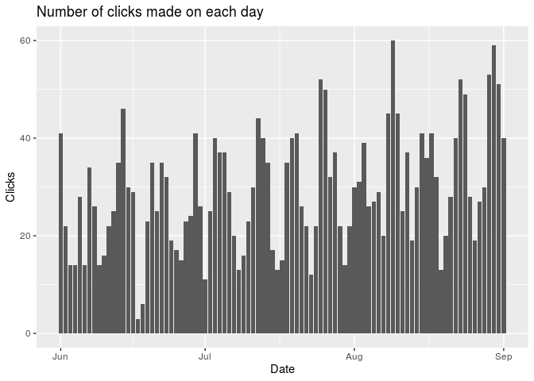
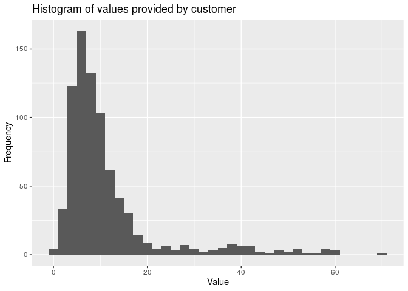
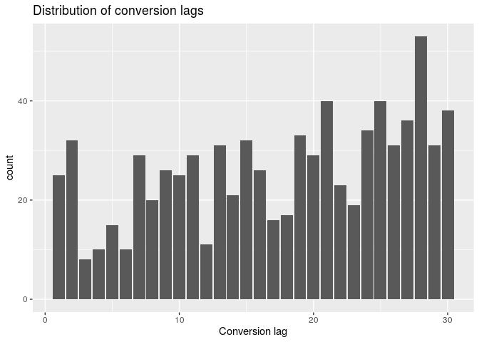

HW3
================
Willie Langenberg
2020-11-20

## Exercise 1: Marketing, conversions and conversion lags

``` r
library(RSQLite)
con <- dbConnect(RSQLite::SQLite(), "../HW_data/seo_marketing_data.sqlite")
# List all available tables
dbListTables(con)
```

    ## [1] "Clicks"           "Conversion_value"

``` r
# Tables are "Conversion value" and "Clicks"
# Pull all data in a table to R.
df_clicks <- dbReadTable(con, "Clicks")
df_conversion <- dbReadTable(con, "Conversion_value")
dbDisconnect(con)
```

``` r
#a)

df_clicks %>%
  count(date) %>%
  mutate(date = as.Date(date)) %>%
  ggplot(aes(x = date, y = n)) + geom_col() +
    labs(title = "Number of clicks made on each day", x = "Date", y = "Clicks")
```



*Figure 1.1:* Histogram that show the amount of clicks made on each day.

In the plot given in Figure1.1 above we can see that the amount of
clicks vary between days.

``` r
#b)
suppressMessages(library(lubridate))
df_clicks %>%
  count(date) %>%
  mutate(date = as.Date(date)) %>%
  mutate(day = wday(date, label = TRUE)) %>%
  group_by("Day" = day) %>%
  summarize("Clicks" = sum(n), .groups = 'drop') %>%
  arrange(desc(Clicks)) %>%
  kable()
```

| Day | Clicks |
| :-- | -----: |
| Mon |    540 |
| Sun |    538 |
| Sat |    470 |
| Tue |    392 |
| Fri |    321 |
| Thu |    234 |
| Wed |    233 |

*Figure1.2:* Table that shows the sum of all clicks made on each day of
the week.

According to the table in Figure1.2 we can say that mondays have most
amount of clicks, followed by sundays. Then given that each click have a
cost, mondays are the most costly.

``` r
#c)

df_conversion %>%
  ggplot(aes(x = value)) + geom_histogram(binwidth = 2) + labs(title="Histogram of values provided by customer", x="Value", y="Frequency")
```

<!-- -->

*Figure1.3:* Histogram of the value costumers provided.

In the histogram given in Figure1.3 we can say that most of the
costumers provide value between 15 and 20.

``` r
#d)

df_convLag <- df_conversion %>% 
  inner_join(df_clicks, by = "id") %>% 
  mutate(date.x = as.Date(date.x)) %>%
  mutate(date.y = as.Date(date.y)) %>%
  mutate(conversionLag = as.numeric(date.x - date.y)) %>%
  rename(conversionDate = date.x, clickDate =  date.y)
  
  
ggplot(data = df_convLag, aes(x = conversionLag)) + 
  geom_bar() + 
  labs(title = "Distribution of conversion lags", x = "Conversion lag") 
```

<!-- -->

*Figure1.4:* Histogram that shows the distribution of conversion lags.

In the histogram given in Figure1.4 we can say that the conversion lags
vary alot. Even between days like 6 and 7 it vary alot, which seems
strange. I can not come up with any reasonable explanation for these
variations. We can instead just interpret what the plot says. It seems
like there is a slight tendency that people wait longer before they buy,
than being impulsive and buy directly. Especially we can say that most
costumers wait 28 days from clicking on the ad, to actually buying.

``` r
#e)
#I do not understand what I should do in this assignment, but I guess this is correct.

# Table 1: Average conversion value
colnames_new <- c("Click Date" = 1, "CL - 25 day" = 2, "CL - 26 day" = 3, "CL - 27 day" = 4,"CL - 28 day" = 5,"CL - 29 day" = 6, "CL - 30 day" = 7)

df_convLag %>%
  filter(conversionLag >= 25) %>%
  group_by(conversionLag, clickDate) %>%
  summarize(avgconValue = mean(value), .groups = 'drop') %>% 
  pivot_wider(names_from = conversionLag, values_from = avgconValue) %>% 
  select(clickDate, "25", everything()) %>%
  arrange(clickDate) %>%
  rename(all_of(colnames_new)) %>%
  tail(n = 5) %>%
  kable()
```

| Click Date | CL - 25 day | CL - 26 day | CL - 27 day | CL - 28 day | CL - 29 day | CL - 30 day |
| :--------- | ----------: | ----------: | ----------: | ----------: | ----------: | ----------: |
| 2020-08-28 |          NA |          NA |    5.689383 |   12.237238 |          NA |          NA |
| 2020-08-29 |          NA |    6.652542 |   11.286285 |   10.244544 |    6.850705 |    1.405680 |
| 2020-08-30 |          NA |          NA |          NA |          NA |    7.675008 |   12.248421 |
| 2020-08-31 |          NA |          NA |          NA |          NA |    7.414132 |    5.019909 |
| 2020-09-01 |          NA |          NA |          NA |    8.704662 |          NA |          NA |

*Figure1.5:* Table that shows the average conversion value for each
given conversion lag and date of click.

``` r
# Table 2: Sum of clicks
df_convLag %>%
  filter(conversionLag >= 25) %>% 
  group_by(clickDate, conversionLag) %>%
  count(clickDate, conversionLag) %>%
  pivot_wider(names_from = conversionLag, values_from = n) %>%
  select(clickDate, "25", everything()) %>%
  arrange(clickDate) %>%
  rename(all_of(colnames_new)) %>%
  tail(5) %>%
  kable()
```

| Click Date | CL - 25 day | CL - 26 day | CL - 27 day | CL - 28 day | CL - 29 day | CL - 30 day |
| :--------- | ----------: | ----------: | ----------: | ----------: | ----------: | ----------: |
| 2020-08-28 |          NA |          NA |           1 |           2 |          NA |          NA |
| 2020-08-29 |          NA |           1 |           1 |           2 |           1 |           1 |
| 2020-08-30 |          NA |          NA |          NA |          NA |           2 |           1 |
| 2020-08-31 |          NA |          NA |          NA |          NA |           1 |           1 |
| 2020-09-01 |          NA |          NA |          NA |           1 |          NA |          NA |

*Figure1.6:* Table that shows the sum of clicks for each given
conversion lag and date of click.

## Exercise 2: SL lines

The data in the SQLite database contains six tables with different
information. We get information about what lines there is in one of the
tables, with variables that tell the stops on the way, for each line. In
another table we can see what name and type of transportation each line
represents. There is also two identical tables which tells the name and
number of every stop point, it’s area number and geographical
coordinates (longitude, latitude). The last table is small and only
contains what suffix is used for each type of transportation code,
translated from english to swedish.

``` r
#b
#Reading in the dataset
sl_con  <- dbConnect(RSQLite::SQLite(), "../HW_data/sl-api.sqlite")
dbListTables(sl_con)
```

    ## [1] "journeyPatterns" "lines"           "sites"           "stopAreas"      
    ## [5] "stopPoints"      "transportmodes"

``` r
df_journeyPatterns <- dbReadTable(sl_con,"journeyPatterns")
df_lines <- dbReadTable(sl_con,"lines")
df_sites <- dbReadTable(sl_con,"sites")
df_stopAreas <- dbReadTable(sl_con,"stopAreas")
df_stopPoints <- dbReadTable(sl_con,"stopPoints")
df_transportmodes <- dbReadTable(sl_con,"transportmodes")

dbDisconnect(sl_con)
```

``` r
#Manually converting formats to numerical
df_journeyPatterns <- df_journeyPatterns %>%
   mutate(JourneyPatternPointNumber = as.numeric(JourneyPatternPointNumber))

df_sites <- df_sites %>%
  mutate(SiteId = as.numeric(SiteId)) %>%
  mutate(StopAreaNumber = as.numeric(StopAreaNumber))

df_stopAreas <- df_stopAreas %>%
  mutate(StopPointNumber = as.numeric(StopPointNumber)) %>%
  mutate(StopAreaNumber = as.numeric(StopAreaNumber))

df_stopPoints <- df_stopPoints %>%
  mutate(StopPointNumber = as.numeric(StopPointNumber)) %>%
  mutate(StopAreaNumber = as.numeric(StopAreaNumber))
```

``` r
df_journeyPatterns %>%
  mutate(StopPointNumber = JourneyPatternPointNumber) %>%
  inner_join(df_stopPoints, by = "StopPointNumber") %>%
  filter(StopAreaTypeCode %in% c("RAILWSTN", "TRAMSTN", "METROSTN")) %>%
  distinct(StopPointNumber, .keep_all = TRUE) %>%
  count("Zone" = ZoneShortName, name = "Amount") %>%
  kable()
```

| Zone | Amount |
| :--- | -----: |
|      |      3 |
| A    |    410 |
| B    |    120 |
| C    |     32 |

*Figur2.1:* Table that shows the amount of unique rail traffic stops in
each ticket zone.

By looking at the table given in Figure2.1 we can first see that there
is three stops with no zone name. This is regarding the stops in
“Bålsta” and “Gnesta” which I assume does not belong to any ticket
zone.

``` r
library(leaflet)
library(mapview)
# Change "line_number" below to view another line
line_number <- 50

line_journey <- df_journeyPatterns %>%
  mutate(LineNumber = as.numeric(LineNumber)) %>%
  filter(LineNumber == line_number) %>%
  select(JourneyPatternPointNumber)
  
line_stoppoints <- df_stopPoints %>%
  filter(as.numeric(StopPointNumber) %in% line_journey[[1]]) %>%
  mutate(LocationNorthingCoordinate = as.numeric(LocationNorthingCoordinate)) %>%
  mutate(LocationEastingCoordinate = as.numeric(LocationEastingCoordinate))
    
m <- leaflet(line_stoppoints, options = leafletOptions(zoomControl = FALSE, dragging = FALSE)) %>%
  addTiles() %>%
  addMarkers(lng=~LocationEastingCoordinate, lat=~LocationNorthingCoordinate, popup= ~StopPointName)

#Doesn't work...
#mapshot(m, file = "Leaflet-plot.png")
#knitr::include_graphics("Leaflet-plot.png")

mapshot(m, url = "Leaflet-plot.html")
knitr::include_graphics("Leaflet-plot.html")
```

<!-- -->

The code is reusable since it is easy to change line number. However I
can’t get the “mapshot” function to save the figure properly. The plot
shows up correctly in r markdown but crashes when “mapshot” tries to
save the figure.

The tables “stopAreas” and “stopPoints” are identical and we could
delete one of them and still have all information.
