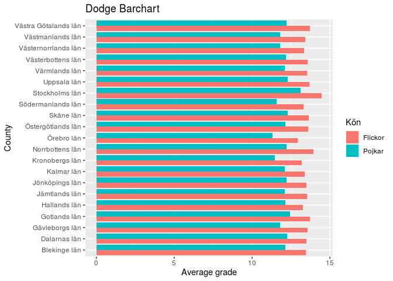
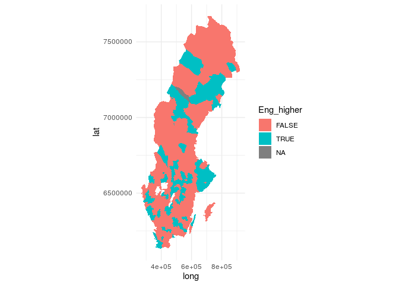

HW4
================
Willie Langenberg
2020-11-25

## Exercise 1: SQL, SQl, Sql, sql\!

We start by creating the connection from R to the database.

``` r
file <- "../HW_data/chinook.db"
con <- dbConnect(RSQLite::SQLite(), "../HW_data/chinook.db")
```

With the connection we can now send and get information trough
“queries”. We start off by computing the average UnitPrice of a
track.

``` r
#Compute the average UnitPrice of a track
avg_unitprice <- dbGetQuery(con, 'SELECT AVG(UnitPrice) FROM tracks')[1,1]
df_tracks <- dbGetQuery(con, "SELECT UnitPrice FROM tracks")
df_tracks %>%
  ggplot(aes(x = UnitPrice)) + 
  geom_histogram(bins = 2) + 
  geom_vline(xintercept = avg_unitprice, color = "Red") +
  geom_text(aes(x=avg_unitprice+0.15, label="<- MEAN", y=2000), colour="white")
```

<!-- -->

We continue with answering which genre has the least amount of tracks.
The data is split into different tables, so we have to join two tables
in the database (tracks and genres), to also be able to get the
name/label of the genre. It appears to be Opera that has the least
amount of tracks, which is not that surprising.

``` r
#Which genre has the least amount of tracks?
dbGetQuery(con, "SELECT genres.Name AS Genre, COUNT(*) AS Count
                  FROM tracks 
                  INNER JOIN genres ON tracks.GenreId = genres.GenreId
                  GROUP BY tracks.GenreId
                  ORDER BY Count 
                  LIMIT 1")
```

    ##   Genre Count
    ## 1 Opera     1

Now we want to find out which genre has the most amount of tracks in a
playlist. For this we will also need to join atleast two tables to get
more information of the data.

``` r
#Which genre has the most amount of tracks in a playlist?
dbGetQuery(con, "SELECT genres.Name, playlist_track.PlaylistId, COUNT(*) AS Count
                FROM tracks 
                LEFT JOIN playlist_track ON tracks.TrackId = playlist_track.TrackId
                LEFT JOIN genres ON tracks.GenreId = genres.GenreId
                GROUP BY genres.GenreId, playlist_track.PlaylistId
                ORDER BY Count DESC
                LIMIT 1")
```

    ##   Name PlaylistId Count
    ## 1 Rock          1  1297

We use the same strategy to answer the last question, which composer has
most tracks in a playlist. Here we have to join multiple tables to see
in which playlist every tracks is, and what every playlist is called.

``` r
#Which Composer (which is not NA) has most tracks in a playlist and what is that playlists name?
dbGetQuery(con, "SELECT Composer, COUNT(*) AS Count, playlists.PlaylistId, playlists.Name
                FROM tracks 
                LEFT JOIN playlist_track ON tracks.TrackId = playlist_track.TrackId
                LEFT JOIN genres ON tracks.GenreId = genres.GenreId
                LEFT JOIN playlists ON playlist_track.PlaylistId = playlists.PlaylistId
                WHERE tracks.Composer IS NOT NULL
                GROUP BY playlists.PlaylistId, Composer
                ORDER BY Count DESC
                LIMIT 1")
```

    ##       Composer Count PlaylistId  Name
    ## 1 Steve Harris    80          1 Music

``` r
dbDisconnect(con)
```

## Exercise 2: Skoleverket’s information about 6th graders

``` r
#Reading the data into R
betyg_csv <- read_delim("../HW_data/exp_betyg_ak6_kommun_2018_19.csv", skip = 6, col_names = TRUE, delim = ";", na=c("", "NA", ".", "..", "-"), locale=locale(decimal_mark=","), col=cols())

#When reading in the data into R there is also one empty column ("X16") included, which we now delete:
betyg_csv <- betyg_csv  %>%
  select(-X16) %>%
  filter(`Typ av huvudman` == "Samtliga") %>%
  drop_na(Län)
```

We begin with reading in the data into R. From the assignment we know
there will be problems for R to parse values with dots and such (“..”,
“.”, “-”). Therefore we set these values as NA’s, which is what they
are, missing values. It is also necessary to set that commas written as
“,” should be treated as the decimal mark. When reading this into R we
still get one “error”, R has created one extra column (“X16”) with only
NA values. If we open the raw .csv file we can see that each line ends
with the delimiter/seperator (“;”). This is why R thinks that there
should be one extra column at the end. I don’t know any simpler way to
fix this than just removing the column after reading in the data.

We continue by now comparing the average grades for girls and boys in
each county. If I have interpreted the data right we should not have to
do any manipulations to the data, to get the average grades. In other
words we don’t have to calculate the weighted means because in the
columns “Flickor\_2” and “Pojkar\_2” we have already have the average
grades for each subject in each municipality. All we have to do is
calculating these means for every county instead. To be able to plot
this we also tidy the data, so the gender is specified in a column
instead.

For this plot I choose to do a “rotated” bar chart where it is really
easy to see the difference between genders in each county. We can see
that girls are outperforming boys in each and every county, interesting.

``` r
betyg_csv %>%
  drop_na(Flickor_2, Pojkar_2) %>%
  group_by(Län) %>%
  summarize(Flickor = mean(Flickor_2), Pojkar = mean(Pojkar_2), .groups = 'drop') %>%
  pivot_longer(Flickor:Pojkar, names_to="Kön", values_to="Betyg") %>%
  ggplot(aes(Län, Betyg, fill = Kön)) + geom_col(position = "dodge") + coord_flip() +
  labs(title = "Dodge Barchart", y="Average grade", x="County")
```

<!-- -->

We should now create a map of Sweden where all the municipalities are
colored according to the event that the mean grade in English is higher
than mean grade in “Idrott och hälsa” or not.

``` r
kommun_karta <- read_csv("../HW_data/kommun_karta.csv",col_names = TRUE, col=cols())

betyg_csv_2 <- betyg_csv %>%
  select(Kommun, id = `Kommun-kod`, Ämne, `Totalt_2`) %>%
  filter(Ämne %in% c("Engelska", "Idrott och hälsa")) %>%
  group_by(Kommun) %>%
  pivot_wider(names_from = Ämne, values_from = Totalt_2) %>% # I want "Engelska" and "Idrott och hälsa" in seperate columns.
  mutate(Eng_higher = Engelska>`Idrott och hälsa`)

kable(head(betyg_csv_2))
```

| Kommun   | id   | Engelska | Idrott och hälsa | Eng\_higher |
| :------- | :--- | -------: | ---------------: | :---------- |
| Ale      | 1440 |     14.6 |             14.8 | FALSE       |
| Alingsås | 1489 |     13.9 |             14.0 | FALSE       |
| Alvesta  | 0764 |     12.6 |             12.8 | FALSE       |
| Aneby    | 0604 |     11.2 |             14.2 | FALSE       |
| Arboga   | 1984 |     12.9 |             12.1 | TRUE        |
| Arjeplog | 2506 |     14.5 |             13.8 | TRUE        |

We have now cleaned the data so it is easier to compare the subjects,
and then plot the map.

``` r
kommun_karta %>%
  left_join(betyg_csv_2, by = "id") %>% #Join the tables together by municipality id.
  ggplot(aes(x = long, y = lat, group = group, fill = Eng_higher)) +
    geom_polygon() +
    coord_fixed() +
    #theme_void()
    theme_minimal()
```

<!-- -->

By looking at the plot we can say that the result vary from municipality
to municipality. It seems like the average grade is therefore very
similar, but it might tend to be more events where the average English
grade is lower. From this conclusion I would maybe plot another map
where we split the data for guys and girls. Maybe guys tend to have
higher average grade in “Idrott och hälsa” than English, and girls the
opposite relation. I don’t know, but it would be interesting to look at.

For the next assignment we should compute the overall mean in Sweden for
each subject.

``` r
betyg_csv %>%
  group_by(Ämne) %>%
  summarize(`Average grade` = mean(Totalt_2, na.rm = TRUE)) %>%
  kable()
```

    ## `summarise()` ungrouping output (override with `.groups` argument)

| Ämne                          | Average grade |
| :---------------------------- | ------------: |
| Bild                          |      13.57370 |
| Biologi                       |      12.70217 |
| Engelska                      |      13.36055 |
| Fysik                         |      12.48700 |
| Geografi                      |      12.82857 |
| Hem- och konsumentkunskap     |      13.50458 |
| Historia                      |      12.71071 |
| Idrott och hälsa              |      13.63633 |
| Kemi                          |      12.34477 |
| Matematik                     |      12.00727 |
| Moderna språk som elevens val |      14.07500 |
| Moderna språk som språkval    |      13.65382 |
| Modersmål                     |      14.18012 |
| Musik                         |      13.63287 |
| Naturorienterande ämnen       |      13.14955 |
| Religionskunskap              |      12.75143 |
| Samhällskunskap               |      12.73226 |
| Samhällsorienterande ämnen    |      13.00556 |
| Slöjd                         |      13.36389 |
| Svenska                       |      13.00311 |
| Svenska som andraspråk        |       6.95545 |
| Teckenspråk                   |      14.65000 |
| Teknik                        |      12.72195 |

In the table above for average grades we can especially see that
“Engelska” have a lower average grade than “Idrott och hälsa”. So we
did interpret the plot correctly, altough I must admit it is much easier
to see the difference in this table.
