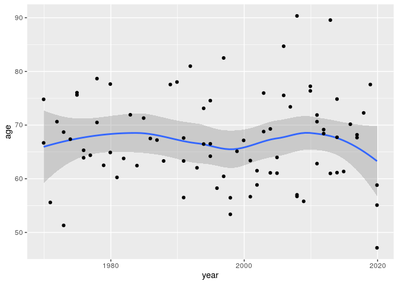

HW6
================
Willie Langenberg
2020-12-13

## Exercise 1: Purrr

#### a)

In this assignment I couldn’t see any point or way to use purrr when
retrieving the data. Already when we just read the data from the API we
have the columns “year”, “category” and “laureates”. When we unnest the
column “laureates” we have all data available, so we can just select the
columns we want. We store this data into “laureates”, see the head of
the dataframe below.

``` r
cache=TRUE
##### Fetching data
# URL for the API
url <-  "http://api.nobelprize.org/v1/prize.json?category=economics"

#Using  fromJSON to read the json formated data into R, then cleaning the data
api_response <- GET(url)
laureates <- fromJSON(url)[[1]] %>%
  filter(as.numeric(year) %in% 1969:2019) %>%
  unnest(laureates) %>%
  select(year, category, firstname, surname, id)

kable(head(laureates, 5))
```

| year | category  | firstname  | surname  | id  |
| :--- | :-------- | :--------- | :------- | :-- |
| 2019 | economics | Abhijit    | Banerjee | 982 |
| 2019 | economics | Esther     | Duflo    | 983 |
| 2019 | economics | Michael    | Kremer   | 984 |
| 2018 | economics | William D. | Nordhaus | 968 |
| 2018 | economics | Paul M.    | Romer    | 969 |

#### b)

Here I started by creating a new function to get the day of birth and
gender with a given “id”. Then I used the “map\_df” function to apply
this function on every “id” in the “laureates” dataframe from a). I
store this new information in “personal\_df” which I then join with the
“laureates” dataframe by “id”. See the head of the two joined
dataframes below.

``` r
cache=TRUE
#Function that fetches the day_of_birth and gender of a given laureates id
get_personal_data <- function(id) {
  api_url <- str_c("http://api.nobelprize.org/v1/laureate.json?id=", id)
  fromJSON(api_url)[[1]] %>%
  select(day_of_birth = born, gender)
}

#Creating a new dataframe "personal_df" to store the data of every "id" in laureates dataframe
personal_df <- map_df(laureates$id, ~data.frame(id = ., get_personal_data(.)))

#Joining the two dataframes together and calling this laureates_info
laureates_info <- laureates %>%
  inner_join(personal_df, by="id")

kable(head(laureates_info, 5))
```

| year | category  | firstname  | surname  | id  | day\_of\_birth | gender |
| :--- | :-------- | :--------- | :------- | :-- | :------------- | :----- |
| 2019 | economics | Abhijit    | Banerjee | 982 | 1961-02-21     | male   |
| 2019 | economics | Esther     | Duflo    | 983 | 1972-10-25     | female |
| 2019 | economics | Michael    | Kremer   | 984 | 1964-11-12     | male   |
| 2018 | economics | William D. | Nordhaus | 968 | 1941-05-31     | male   |
| 2018 | economics | Paul M.    | Romer    | 969 | 1955-00-00     | male   |

#### c)

In the table below we can easily see the proportions of gender between
laureates. The proportion of female laureates among all current
laureates in economics is \(2.4\%\).

``` r
laureates_info %>%
  count(gender, name = "count") %>%
  mutate(proportions = round(count / sum(count), 3)) %>%
  kable
```

| gender | count | proportions |
| :----- | ----: | ----------: |
| female |     2 |       0.024 |
| male   |    82 |       0.976 |

#### d)

The age on the y-axis is the age of the laureate at the time the prize
was given. In the geom\_smooth plot below we can see how the “average”
age of every laureates changes over time. We can see that the prize is
usually given to people (mostly men) in the age between 55 and 80.
Especially we can see a slightly higher age at 2010 and a slight
downward trend since then.

``` r
laureates_info %>%
  mutate(year = as.Date(str_c(year,"-12-1")), 
         age = year - as.Date(day_of_birth),
         age = as.numeric(age)/365) %>%
  ggplot(aes(x = year, y = age)) + geom_smooth() + geom_point()
```

    ## `geom_smooth()` using method = 'loess' and formula 'y ~ x'

<!-- -->

## Exercise 2: Starting your project

#### a)

##### Sentiment analysis on society’s view of the stock market

#### b)

Before a stock market crash, there is often a time of economic booming.
I want to see how the sentiment about the stock market changes during a
set period of time. Obviously the sentiment should change before and
after a crash, but maybe we can see patterns building up before the
crash. This project/report is intended to be read by a company’s board.
So the purpose of the analysis is to see if a society’s sentiment could
be used as an indicator of a stock market crash.

#### c)

I have not yet collected any data. I am still searching for a reasonable
source that could reflect a society’s view of the stock market. So when
I find the data I could perform a similar analysis of the data as we did
in HW5 Exercise\_1c. To be able to draw any conclusions or at least be
able to plot any trends, I think I need a rather big volume of data. I
should at least have a few values of sentiment per month. The period of
interest could be from the year 2000 to present time. I think it might
be hard to find useful data before that period of time.

#### d)

I am not sure about how thoroughly the analysis should be. The point of
the project I guess, is to show and train the ability to retrieve, clean
and visualize data. So I assume I should not put too much work into the
analysis part. Because I am sure the analysis could be made much more
complex than we did in HW5.

#### e)

Personally I don’t think the data retrieval trough APIs or web scraping
will be any bigger problem. However I think it is going to take some
time to clean and tidy the data. Depending on the availability I might
have to fetch data from a multiple of different sources.
