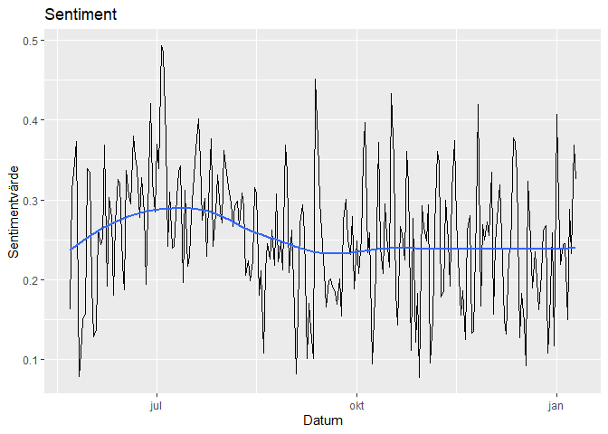
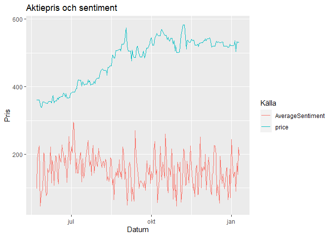
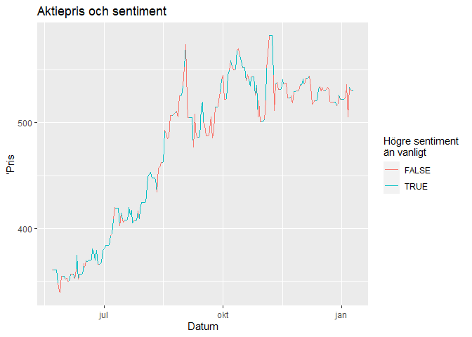
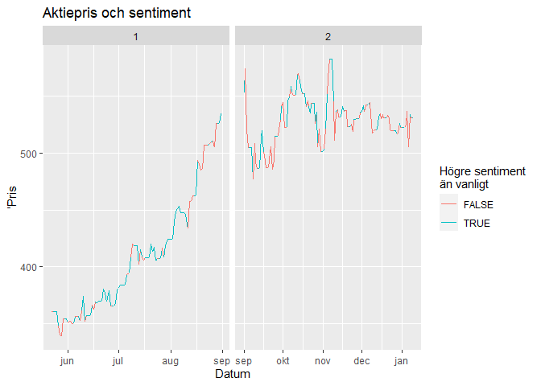

Sentiment analys av en aktie
================
Willie Langenberg
2021-01-15

## Introduktion

### Inledning

När det gäller aktieanalys, finns det ett hav av olika indikatorer. Jag
har och är fortfarande intresserad av att hitta nya sätt att förutspå en
aktiekurs. Vi blev introducerad till sentiment analys i en hemläxa i
kursen MT5013. Detta väckte direkt frågan hos mig, kan detta vara
applicerbart någon annanstans, på aktiemarkanden kanske? Mitt mål med
denna rapport är att se huruvida sentiment påverkar en aktiekurs.
Logiskt sett borde det finnas ett samband, vilket även flera
vetenskapliga rapporter har undersökt. En sökning på “sentiment analysis
stock market” via Google Scholar ger 470 000 resultat.

### Metod

Jag har valt att använda data från Stocktwits, som kan jämföras som ett
twitter för aktier. För varje aktie, index etc. finns ett feed där folk
kan kommentera vad det tycker om aktien. Mitt mål är då att undersöka
vad sentimentet av varje meddelande är och jämföra med aktiekursen, för
att se om det finns ett samband över tid. Datan från Stocktwits hämtar
jag med hjälp av deras API. I dokumentationen angav de några
begränsningar som skapade lite problem. Vid varje förfrågan eller “Get”
gavs endast 30 meddelanden tillbaka och jag fick endast skicka 200
förfrågningar i timmen. Jag ville ha data för åtminstone ett halvår
tillbaka vilket innebar att jag behövde skicka ungefär 1733
förfrågningar vilket gav 52000 meddelanden. För att följa de givna
begränsningarna skrev jag en funktion som skickar 50 förfrågningar och
sedan väntar i 15min för att sedan upprepa, tills den skickat ett
angivet antal förfrågningar. För att värdera sentimentet av ett
meddelande kommer jag använda en “ordbok”\[1\] som anger ett “market
sentiment” för 8,331 antal ord. Sentimentvärdet av ett meddelande
betraktar jag då som summan av värdet på alla enskilda ord. Att hämta
aktie prisdatan var avsevärt lättare. Jag använde ett paket som heter
“tidyquant” där jag med hjälp av funktionen “tq\_get” kunde hämta data
för en given aktie, start- och stopdatum.

## Data

Målet med analysen är att se om vi kan hitta några samband mellan
sentimentet i meddelanden om en aktie, och dess pris. För att begränsa
datan något behöver jag välja en aktie som är lite obekant i jämförelse
med exempelvis Google eller Apple. Jag väljer att betrakta aktien
NVIDIA, ett elektronikföretag som främst tillverkar grafikkort. Vi
börjar med att hämta data för meddelanden. Detta gör vi som sagt med
deras API. Nedan skriver och använder jag en funktion för att hämta all
data och samtidigt vara inom ramarna för begränsningarna.

``` r
#Funktion för att hämta data från Stocktwits. 
#symbol,  anger en "börssymbol", unik för varje aktie.
#n,       anger hur många förfrågningar som ska göras
#add,     anger ett alternativ för att kunna hämta data från och med ett angivet datum. 
get_stocktwits <- function(symbol, n, add="") {
  url <- str_c("https://api.stocktwits.com/api/2/streams/symbol/", symbol, ".json")
  first_response <- fromJSON(str_c(url,add))
  container <- first_response[[4]]
  counter <- 1
  while(counter <= n){
    min_id <- min(container$id)
    if(counter %% 50 == 0) {
      print(str_c(counter, "/", n)); flush.console()
      Sys.sleep(920)
    }
    
    new_response <- GET(str_c(url, "?max=", min_id))
    status <- new_response$status_code
    
    if (status != 200){
      print(str_c("Error! Only downloaded:", counter, "/", n, ", Status code:", status))
      return(container)
      }
    
    new_contain <- fromJSON(content(new_response, as = "text"))
    container <- container %>% bind_rows(new_contain$messages)
    counter <- counter + 1
    error <- 0
  }
  print(counter)
  return(container)
  }
```

Jag har använt funktionen och hämtat all data i förväg, då det tog
ungefär 9 timmar allt som allt. Nedan har jag visast hur jag använde
funktionen “get\_stocktwits” tre separata gånger. Första användningen
med \(n = 1200\) gav endast data från och med 2020-08-19, vilket betydde
att jag behövde använda funktionen igen, och sedan en sista gång.
Funktionen är inte perfekt, jag hade exempelvis kunnat använda ett
stopdatum som argument istället för “n”, men denna lösning fungerade
också.

``` r
#Här använder vi funktionen get_stocktwits som jag skrivit för att hämta all data.
#Jag insåg här att det hade varit bättre om det istället för argumentet "n" fanns ett argument som 
#angav stopdatum så den automatiskt hämtar all data till och med en given dag tillbaka i tiden. 

#symbol <- "NVDA"

#Data from 1200*30 messages back in time from now
#stock_df <- get_stocktwits(symbol, 1200)
#print(min(stock_df$created_at))

#Data from 201*30 messages back in time from last observation above
#last_obs_id <- min(stock_df$id)
#stock_df_2 <- get_stocktwits(symbol, 201, str_c("?max=", last_obs_id))
#print(min(stock_df_2$created_at))

#Data from 350*30 messages back in time from last observation above
#last_obs_id_2 <- min(stock_df_2$id)
#stock_df_3 <- get_stocktwits(symbol, 350, str_c("?max=", last_obs_id_2))
#print(min(stock_df_3$created_at))

#save(stock_df, file = str_c(symbol, "_data.RData"))
#save(stock_df_2, file = str_c(symbol, "_data_2.RData"))
#save(stock_df_3, file = str_c("data/", symbol, "_data_3.RData"))
```

Jag läser nu in den sparade datan, samt ordlistan\[1\] som anger dess
marknadssentiment.

``` r
#Laddar den sparade stocktwits datan
load("../data/NVDA_data_1.RData")
load("../data/NVDA_data_2.RData")
load("../data/NVDA_data_3.RData")
stock_df_raw <- stock_df %>%
  bind_rows(stock_df_2, stock_df_3) %>%
  select(id, word = body, created_at) %>%
  mutate(date = str_split(created_at, "T", simplify = TRUE)[,1]) %>%
  arrange(id)

#Läser in sentiment ordlistan
# NTUSD-Fin: A Market Sentiment Dictionary for Financial Social Media Data Applications
# http://nlg.csie.ntu.edu.tw/nlpresource/NTUSD-Fin/
sent_df_raw <- fromJSON("../data/NTUSD_Fin_word_v1.0.json")
sent_df <- sent_df_raw %>%
  select(word = token, sentiment = market_sentiment)

sent_df %>%
  slice(1:5) %>%
  kable()
```

| word        |   sentiment |
| :---------- | ----------: |
| notes       |   1.0812109 |
| manipulator |   1.2216922 |
| sucked      | \-1.5074093 |
| garage      |   1.0696891 |
| aids        |   0.9221319 |

**Tabell 1:** Ordlista som anger sentimentvärdet för ett urval av ord.

Vi går vidare genom att beräkna sentiment värdet för varje meddelande i
den sammansatta dataframen “stock\_df\_raw”. Detta sparar vi som
“stock\_df\_avgmessage” där då sentimentet beräknas som summan av
sentimentvärdet för varje ord. Notera att endast ord som finns i både
dataframen “stock\_df\_raw” och “sent\_df” betraktas. Se tabell 2 som
visar tabellens utseende.

``` r
# Using the dictionary (sent_df) to calculate sentiment of messages (stock_df)

stock_df_avgmessage <- stock_df_raw %>%
  mutate(date = as.Date(date)) %>%
  separate_rows(word) %>%
  mutate(word = str_to_lower(word, locale = "en")) %>%
  mutate(word = str_remove(word, pattern = "[[:punct:]]")) %>%
  inner_join(sent_df, by=c("word" = "word")) %>%
  group_by(id, created_at, date) %>%
  summarize(AverageSentiment = mean(sentiment), .groups = 'drop')

stock_df_avgmessage %>%
  select(-created_at) %>%
  slice(1:5) %>%
  kable()
```

|        id | date       | AverageSentiment |
| --------: | :--------- | ---------------: |
| 214553801 | 2020-05-22 |        0.2724122 |
| 214554243 | 2020-05-22 |        0.6618592 |
| 214554658 | 2020-05-22 |        0.0730601 |
| 214554846 | 2020-05-22 |        0.2724122 |
| 214555154 | 2020-05-22 |      \-0.5951644 |

**Tabell 2:** Sentiment värdet för varje meddelande.

Med varje meddelandes respektive id kan vi även visa hela inlägget i
stocktwits genom att gå in på länken
“<https://stocktwits.com/message/><ID>”. Från dataframen som
innehåller sentiment för varje meddelande kan vi visa de meddelanden
som har bland de hösta och minsta värdena. Exempel på meddelanden med
särskilt negativa sentiment är

](../data/scrshot/pic_1.png)

](../data/scrshot/pic_2.png)

](../data/scrshot/pic_3.png)

På samma sätt kan vi illustrera några meddelanden med särskilt positiva
sentiment.

](../data/scrshot/pic_4.png)

](../data/scrshot/pic_5.png)

](../data/scrshot/pic_6.png)

Notera att den sista kommentaren faktiskt är negativ men ändå har ett
positivt sentiment utifrån våra beräkningar. Detta är inte ett unikt
fall utan jag upptäckte även att några andra texter var felberäknade. Vi
får dock anta att majoriteten av alla sentiment reflekterar dess sanna
värde någorlunda bra.

Vi beräknar nu medelvärdet av sentimentet för varje dag. Vi kan därefter
plotta detta, vilket direkt ger oss en inblick i hur sentimentet ändras
över tid.

    ## `geom_smooth()` using method = 'loess' and formula 'y ~ x'

<!-- -->

**Figur 1:** Plot för sentimentet över tid.

Om vi betraktar plotten som visas i figur 1 verkar det som att alla
sentiment värden är positiva. Vi ser även med hjälp av den assisterande
medelvärdes linjen visar någon svag tendens till en uppgång av sentiment
i början av intervallet och sedan en nedgång. Angående att vi bara har
positiva värden beror nog på att de flesta ord i ordlistan “sent\_df”
har ett positivt sentiment. När vi då summerar värden för flera ord
kommer de då oftast bli positiva kan man tänka sig. Detta illustreras
med tabell 3 nedan, som visar att hela \(80\%\) har positivt sentiment.
Givetvis kan alla de positiva meddelandena även bero på att det har
varit en generellt positiv syn på aktien, men det är orealistikt att det
inte finns en negativ dag på ett halvårstid.

| Sentiment \> 0 | Sentiment \< 0 |
| -------------: | -------------: |
|      0.8006242 |      0.1993758 |

**Tabell 3:** Andel ord med positivt och negativt sentiment

Vi hämtar nu prisdatan för aktien. För att göra detta använder jag
funktionen “tq\_get” från tidyquant. Vi hämtar data för hela perioden
som vi beräknat sentiment för.

| symbol | date       |   open |   high |    low |  close |   volume | adjusted |
| :----- | :--------- | -----: | -----: | -----: | -----: | -------: | -------: |
| NVDA   | 2020-05-22 | 353.01 | 363.72 | 348.53 | 361.05 | 25969100 | 360.6708 |
| NVDA   | 2020-05-26 | 366.27 | 367.27 | 346.88 | 348.71 | 19269500 | 348.3438 |
| NVDA   | 2020-05-27 | 345.00 | 345.31 | 319.87 | 341.01 | 29397300 | 340.6519 |
| NVDA   | 2020-05-28 | 336.49 | 350.42 | 335.17 | 339.48 | 18372400 | 339.1235 |
| NVDA   | 2020-05-29 | 342.18 | 355.02 | 339.40 | 355.02 | 18648000 | 354.6472 |
| NVDA   | 2020-06-01 | 353.33 | 353.63 | 347.58 | 352.25 |  9746900 | 351.8801 |
| NVDA   | 2020-06-02 | 351.85 | 353.49 | 346.32 | 353.01 |  9783000 | 352.6393 |
| NVDA   | 2020-06-03 | 352.89 | 354.65 | 348.00 | 350.78 |  9136000 | 350.4116 |
| NVDA   | 2020-06-04 | 349.12 | 357.73 | 347.10 | 350.66 | 10607000 | 350.4516 |
| NVDA   | 2020-06-05 | 351.78 | 359.88 | 348.32 | 356.80 | 12043700 | 356.5879 |

**Tabell 4:** Första 10 observationerna av aktiedata för NVIDIA under
perioden (2020-05-22 - 2021-01-10).

De flesta variabler är uppenbara. De anger volym, min-, max-, öppnings-
samt slutpris för en aktie under den givna dagen. Den sista kolumnen
“adjusted” anger slutpriset som kort sagt är justerat för eventuella
aktiesplittar osv. som påverkat priset på aktien. Det är adjusted vi
kommer betrakta som priset för aktien.

Observera att det inte finns observationer för varje dag, utan vissa
dagar hoppas över. Detta beror på att aktier inte kan handlas under
helgdagar. Vi antar då att det senaste pris från föregående dag är
konstant. Vi går vidare genom att lägga ihop dataframen för sentiment
och priserna samt justerar de värden som fattas på helger osv. Se tabell
5 för den fullständiga tabellen med sentimentvärden och aktiepris för
varje dag.

| date       | AverageSentiment |    price |
| :--------- | ---------------: | -------: |
| 2020-05-22 |        0.1628018 | 360.6708 |
| 2020-05-23 |        0.3123238 | 360.6708 |
| 2020-05-24 |        0.3456065 | 360.6708 |
| 2020-05-25 |        0.3736120 | 360.6708 |
| 2020-05-26 |        0.0784183 | 348.3438 |
| 2020-05-27 |        0.1084903 | 340.6519 |
| 2020-05-28 |        0.1507078 | 339.1235 |
| 2020-05-29 |        0.1573313 | 354.6472 |
| 2020-05-30 |        0.3394118 | 354.6472 |
| 2020-05-31 |        0.3351663 | 354.6472 |

**Tabell 5:** Tabell med sentimentvärde och aktiepris för varje dag.

Med den data vi har nu, kan vi plotta priset samt sentimentet över tid
för att se om det finns några trender. Vi behöver då skala upp
sentimenten eftersom de har ett avsevärt lägre värde jämfört med priset.
Grafen för sentimentvärdet kan då inte kopplas till värdet på y-axeln
men vi kan iallafall se hur den beteer sig i relation till priset. Se
figur 2 som visualiserar aktiepriset samt det skalade sentimentvärdet
över tid.

``` r
#Plots the stock price and sentiment over time with a scaled sentiment.
stock_df %>%
  mutate(AverageSentiment = 600*AverageSentiment)%>%
  pivot_longer(-date, names_to = "source", values_to = "price") %>%
  ggplot(aes(x=date, y = price, color=source)) + geom_line() +
  labs(title="Aktiepris och sentiment", y="Pris", x="Datum", color="Källa")
```

<!-- -->

**Figur 2:** Plot för NVIDIAs aktiepris och skalat sentiment över tid.

För att göra det ännu tydligare att se sambandet, kan vi färglägga de
delar av aktieprisets kurva som har ett sentimentvärde större än
medelvärdet. Se figur 3 nedan där vi kan se att det positiva
sentimentet i början av intervallet tyder på en uppgång i aktiepriset.
Efter uppgången verkar både priset och sentimentet för aktien ha
stagnerat, de går varken upp eller ned. Enligt plotten ser vi även att
aktien verkar ha både små uppgångar med negativt(lågt) sentiment och
nedgångar med positivt(högt) sentiment. Det verkar alltså som att det
inte går att dra några slutsatser angående prisets riktning med hjälp av
sentimentet på kort sikt.

``` r
#Plots the stock price with color to identify when the sentiment is above average.
stock_df %>%
  ggplot(aes(x = date, y=price, color=(AverageSentiment > mean(AverageSentiment)))) + 
  geom_line(aes(group=1)) + 
  labs(title = "Aktiepris och sentiment", x = "Datum", y = "'Pris", color = "Högre sentiment \nän vanligt")
```

<!-- -->

**Figur 3:** Plot för NVIDIAs aktiepris i samband med sentiment över
tid.

Se nu figur 4 där vi delat in grafen i två perioder, innan september
2020 och efter. Vi kan då grovt klassificera perioderna som en
uppgångsfas och en “stagnationsfas” där aktien är i uppgång respektive
står still. I period 2 verkar det inte som att priset och sentimentet
har något märkbart samband. I den perioden går ju heller inte aktien
varken upp eller ned särskilt mycket. I period 1 verkar vi dock i stor
grad ha positiva sentimentvärden, samtidigt som aktien faktiskt är i en
uppgång. I slutet av period 1 har vi några negativa sentiment. Vi kan
spekulera och säga att de beror på att folk kanske tycker aktien är
övervärderad och uttrycker sig negativt om priset. Hursomhelst

``` r
stock_df %>%
  mutate(period = ifelse(date < as.Date("2020-09-01"), "1", "2")) %>%
  ggplot(aes(x = date, y=price, color=(AverageSentiment > mean(AverageSentiment)))) + 
  geom_line(aes(group=1)) + 
  facet_wrap(~period, scales = "free_x") +
  labs(title = "Aktiepris och sentiment", x = "Datum", y = "'Pris", color = "Högre sentiment \nän vanligt")
```

<!-- -->

**Figur 4:** Plot för NVIDIAs pris och sentiment över tid, uppdelat i
två perioder.

## Diskussion

Jag tycker att resulatet blev intressant. Vi visade att i detta fall,
verkar det finnas något samband mellan sentimentet och aktiepriset,
vilket också var förväntat. Det finns dock många förbättringsmöjligheter
med analysen. Vi skulle kunna analysera fler aktier, se på en längre
tidsperiod, använda fler källor (Exempelvis Twitter, media etc.) och
beräkna sentiment värdet med större precision. Jag tycker främst att
det skulle vara intressant att se hur sambandet sett ut under en lite
längre tidsperiod. Det skulle även vara intressant att se hur
sentimentet såg ut i början av 2020, när pandemin utvecklades. Viktigt
att tilläga är att jag här mer eller mindre försökt förklara
aktieprisets utveckling med sentimentets utveckling. Jag vågar dock inte
uttala mig om det skulle gå att prediktera priset med hjälp av
sentimentet.

## Referenser

*\[1\]:* Chung-Chi Chen, Hen-Hsen Huang and Hsin-Hsi Chen. 2018.
NTUSD-Fin: A Market Sentiment Dictionary for Financial Social Media Data
Applications. In Proceedings of the 1st Financial Narrative Processing
Workshop, 7 May 2018, Miyazaki, Japan.
