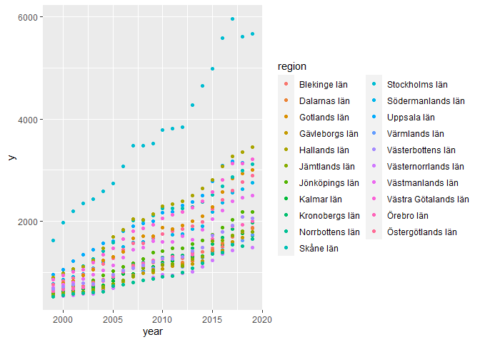

The Swedish Housing Market
================
Willie Langenberg
2021-02-28

## Abstract

In this report I am analysing the differences in mean house prices
across different counties in Sweden, during the year 1999-2019. The
purpose is to see if there is any differences between counties, and if
we can explain the price with the explanatory variables salary and
population density. It turns out that there actually is a highly
significant difference between counties, and that our explanatory
variables explain the variation efficiently. This report is based on
panel data, and the analysed with panel data methods.

## Introduction

The housing market vary a lot across different parts of a country. The
houses being sold does not only differ size and design but also in
pricing. I want to analyse and try to explain the general pricing of
houses being sold in different counties in Sweden. With data containing
information about the salary and population density in a given country,
I will try to build a model for explaining the price difference of
houses being sold in Sweden.

## Data

Data is in panel data structure with balanced panels, meaning we have
the same number of observation on each cross-section unit. The data is
downloaded from Statistics Sweden (scb.se). The response variable is the
mean purchase price of small houses being sold in a year, given in
thousand Swedish crowns. The explanatory variables is the median salary
given in thousand Swedish crowns, and population density given as number
of inhabitants per square kilometer. The format of the data is panel
data meaning we have multidimensional data observed over time. We have
data for every county (21) in Sweden, between the years 1999 to 2019.
See figure 1 below for an brief overview of the data.

|    y | region         | year | salary | pop\_density |
| ---: | :------------- | :--- | -----: | -----------: |
| 1968 | Stockholms län | 2000 |  193.0 |        279.7 |
| 2192 | Stockholms län | 2001 |  202.4 |        282.1 |
| 2349 | Stockholms län | 2002 |  209.2 |        283.8 |
| 1049 | Uppsala län    | 2000 |  174.1 |         41.8 |
| 1222 | Uppsala län    | 2001 |  182.7 |         42.2 |
| 1336 | Uppsala län    | 2002 |  190.9 |         42.4 |

The dataframe

**Figure 1:** Overview of the dataframe with years between 2000 and 2002
selected.

## Analysis

### Data exploration

We start by looking at the dependence between each variable to get some
grasp about the data. See figure 2 below for a correlation plot of the
variables. The response variable seem to be correlated with both salary
and population density. At the same time, salary and population density
does not correlate that much. This will prove to help us against
multicollinearity later, when we will try to fit a model to the data. We
can also see that the correlations are positive.

<!-- -->

**Figure 2:** Correlation plot showing the correlation between each
variable.

We go one step further and plot the response variable to each
explanatory variable. See figure 3 below for the pairwise plots, colored
for which county the data is regarding. We can see that the
relationships seems to be linear, and have a similar slope for each
county. However, there is substantial difference regarding the
intercept. It should therefore be preferable to use a model with
different intercepts for each county.

<!-- -->

**Figure 3:** Pairwise line plots showing the relation between the
respone variables and each explanatory variables. The lines have
different color depending on which county it is regarding.

### Modeling

When modeling the data I will use methods described in “Notes in
Econometrics” \[1\]. The format of our data is panel data. We are to use
panel data methods .

### Pooled OLS regression

A first naive attempt is to just ignore the panel data structure, and
use the so called pooled OLS regression model. We are then pooling
together the data and just ignoring the regions. This model will then
give us constant intercept and slopes. We can then write the model as
\[ Y_{jt} = \beta_1 + \beta_2X^{2}_{jt} + \beta_3X^{3}_{jt} + \epsilon_{jt},\]
where \(j\) is the subject and \(t\) is the time period, with
explanatory variables \(X^{(k)}\) for \(k = 2, 3\). The notation is
copied from the corresponding chapter about pooled OLS regression, in
“Notes in Econometrics”\[1\]. In this model we assume the error terms
\(\epsilon_{jt}\) to be i.i.d with zero expected value and constant
variance \(\sigma^2\). We will now try to fit this model to our data.
See figure 4 below for an summary of this model. All the estimated
variables are highly significant, meaning we can reject the hypothesis
that they are equal to zero with the risk of being wrong is less than
\(0.01%\). We have a decent adjusted R2 being \(0.8526\).

    ## 
    ## Call:
    ## lm(formula = y ~ salary + pop_density, data = df)
    ## 
    ## Residuals:
    ##      Min       1Q   Median       3Q      Max 
    ## -1042.18  -214.77   -59.22   189.77  1108.79 
    ## 
    ## Coefficients:
    ##               Estimate Std. Error t value Pr(>|t|)    
    ## (Intercept) -1889.5653    92.5700  -20.41   <2e-16 ***
    ## salary         13.7173     0.4156   33.01   <2e-16 ***
    ## pop_density     7.2788     0.2438   29.86   <2e-16 ***
    ## ---
    ## Signif. codes:  0 '***' 0.001 '**' 0.01 '*' 0.05 '.' 0.1 ' ' 1
    ## 
    ## Residual standard error: 326.1 on 438 degrees of freedom
    ## Multiple R-squared:  0.8533, Adjusted R-squared:  0.8526 
    ## F-statistic:  1274 on 2 and 438 DF,  p-value: < 2.2e-16

**Figure 4:** Summary output of the pooled ols regression model fitted
on our data.

This model is simple, and rather unfitting for our purpose to analyze
differences between counties.

### Fixed Effects Model

The natural evolvment would be to use a model that uses different
intercepts among subjects. This is something we can achieve with the
fixed effects model, also called Least-Squares Dummy Variable (LSDV)
model. The equation for this model is
\[ Y_j =  D^T_j \alpha_j + X_j\beta + \epsilon_j,\] where
\(D_j^T = [ D_1, D_2, \dotsc D_n ]\) is a dummy variable indicating the
j-th unit and \(\alpha^T = [\alpha_1, \alpha_2, \dotsc, \alpha_n]\) is a
vector of coefficients. Now we fit this model to our data. See figure 5
below for the summary output of this model. All coefficients are
significantly different from zero, and we have an adjusted R2
as high as \(0.9936\). This model is considerably better than the
previous pooled ols model, meaning it explains more of the variation in
the data. Because the dummy variables are significant we can then
conclude that there is a significant difference between prices across
different regions (counties).

    ## 
    ## Call:
    ## lm(formula = y ~ salary + pop_density + factor(region) - 1, data = df)
    ## 
    ## Residuals:
    ##     Min      1Q  Median      3Q     Max 
    ## -427.93  -80.37   -8.52   61.25  501.31 
    ## 
    ## Coefficients:
    ##                                      Estimate Std. Error t value Pr(>|t|)    
    ## salary                                12.4741     0.1999   62.40   <2e-16 ***
    ## pop_density                           27.1726     1.1292   24.06   <2e-16 ***
    ## factor(region)Blekinge län         -2964.6226    63.2563  -46.87   <2e-16 ***
    ## factor(region)Dalarnas län         -1949.9356    50.5994  -38.54   <2e-16 ***
    ## factor(region)Gotlands län         -1333.6138    47.9324  -27.82   <2e-16 ***
    ## factor(region)Gävleborgs län       -2116.4854    49.6155  -42.66   <2e-16 ***
    ## factor(region)Hallands län         -2254.5166    65.8936  -34.22   <2e-16 ***
    ## factor(region)Jämtlands län        -1664.7190    51.6826  -32.21   <2e-16 ***
    ## factor(region)Jönköpings län       -2411.0338    53.6102  -44.97   <2e-16 ***
    ## factor(region)Kalmar län           -2167.7586    49.4543  -43.83   <2e-16 ***
    ## factor(region)Kronobergs län       -2172.8445    50.4773  -43.05   <2e-16 ***
    ## factor(region)Norrbottens län      -1978.9716    53.9867  -36.66   <2e-16 ***
    ## factor(region)Skåne län            -3750.2542   117.9367  -31.80   <2e-16 ***
    ## factor(region)Stockholms län       -8027.4651   336.0083  -23.89   <2e-16 ***
    ## factor(region)Södermanlands län    -2337.1568    58.7161  -39.80   <2e-16 ***
    ## factor(region)Uppsala län          -1977.5636    58.2444  -33.95   <2e-16 ***
    ## factor(region)Värmlands län        -2067.2399    49.0972  -42.10   <2e-16 ***
    ## factor(region)Västerbottens län    -1675.3251    52.4209  -31.96   <2e-16 ***
    ## factor(region)Västernorrlands län  -2209.8055    51.2244  -43.14   <2e-16 ***
    ## factor(region)Västmanlands län     -2585.7089    60.6284  -42.65   <2e-16 ***
    ## factor(region)Västra Götalands län -2722.4630    74.6050  -36.49   <2e-16 ***
    ## factor(region)Örebro län           -2449.9513    53.0305  -46.20   <2e-16 ***
    ## factor(region)Östergötlands län    -2175.3599    56.3176  -38.63   <2e-16 ***
    ## ---
    ## Signif. codes:  0 '***' 0.001 '**' 0.01 '*' 0.05 '.' 0.1 ' ' 1
    ## 
    ## Residual standard error: 139.4 on 418 degrees of freedom
    ## Multiple R-squared:  0.9939, Adjusted R-squared:  0.9936 
    ## F-statistic:  2963 on 23 and 418 DF,  p-value: < 2.2e-16

**Figure 5:** Summary output of the one-way fixed effects model.

The coefficients in the model are easy to interpret. The coefficient for
e.g. the salary is positive meaning if the salary increases the price of
the houses increases. More exact, if the median salary increases with
1000 crowns the model predicts the mean house price to increase with
12000 crowns. The same principle applies for the population density.
Further, the dummies coefficients are only altering the intercept of the
“regression line”. Our model is also known as the one way fixed effects
model. We can also include time effect into the model, by adding dummy
variables for each year. This model is known as the two way fixed
effects model. With time effect we can also pick up patterns regarding
the price changes over time, even though we already explain most of the
variation. The equation for this model is
\[ Y_{jt} =  D^T_{jt} \alpha_{j} + \gamma_j E^T_{jt} + X_{jt}\beta + \epsilon_{jt}, \]
where \(D^T_{jt}\alpha_j\) is the coefficients for the dummy variables
regarding region as before, and \(\gamma_j E^T_{jt}\) are the dummy
variable and coefficients for the time. We fit this model aswell. Almost
all coefficients are significantly different from zero (p-value \< 0.05)
except the the dummy variables for the years 2000 and 2017. The adjusted
R2 for this model is just slightly better, being \(0.9942\).

We can now compare the one way- and two way fixed effects model by using
a formal F-test using coefficients of determination from
restricted/unrestricted regression. The two-way fixed effect model is
then our unrestricted model. Our null hypothesis in this case is that
the dummy coefficients for time are equal to zero, and the alternative
hypothesis that atleast one of them is different from zero. The
F-statistic is given by
\[ F = \frac{(R^2_u-R^2_r)/(n-1)}{(1-R^2_u)/(nT-k)}, \] which follows a
F distribution with \((n-1)\) degrees of freedom and \((nT-k)\). Given
the two models we have, we can calculate the F-statistic as \(F =\)
2.3494792 , which have the p-value 0.0009715229. We can therefore reject
the null hypothesis and conclude that there is a time effect on the
price. However, the coefficient of determination (Adj R2) is
not that different from the previous model. They are very similar, but
one of the models is considerably simpler, with 21 less coefficients to
estimate. Generally a simpler model is more preferable.

We can test another model, called the random effects model. Instead of
modeling the differences between cross-sectional units by shifting the
intercept, it consider these differences as randomly distributed.
However, I am rather convinced that the price difference between each
county shifts in intercept, and have similar slope. We can confirm this
by the plot given in figure 6. In the plot we can see how price is
increasing over time, and the difference between counties seems to be
the shift in intercept.

<!-- -->

**Figure 6:** Plot of price over time, colored by what county it
represents.

### Control of assumptions

The one-way fixed effects model we are using is a classical regression
model. The assumptions we are making when using the model is that the
disturbance terms \(\epsilon_j\) are independent and identically
distributed and have the expected value zero. We also assume no
autocorrelation, meaning that the correlation between any two
\(\epsilon_i\) and \(\epsilon_j\) is zero regardless of the explanatory
variables. By examining the residuals we can often tell if the model is
denying the assumptions or not.

First, consider the residuals given in figure 7. The residuals is
plotted against the index, where the data is sorted as region then year.
The first 21 residuals is therefore representing the region Stockholm,
years 1999-2019. From the plot I draw the conclusion that the residuals
are behaving like a “white noise”, meaning the variance seem to be the
same, and not correlated to each other.

<!-- -->

**Figure 7:** Residual plot for the one-way fixed effects model.

We can also plot the residuals against the fitted values, see figure 8.
Here something intresting happens, it seems like the residuals are
showing some trend and also having larger variance for higher fitted
values.

<!-- -->

**Figure 8:** Residual plot against fitted values

We try to fix this by just fitting a new model wheras we instead
consider the logaritm of the response variable. After we have done this
the new model actually got even better Adj R2 (\(0.999\)),
and all coefficients are still highly significant different from zero.
When trying to plot the new residual plots they do not show any sign of
not fulfilling the assumptions, especially see figure 8 and figure 9.

<!-- -->

**Figure 8:** Residual plot against index for the new model.

<!-- -->

**Figure 9:** Residual plot against fitted values for the new model.

In the new residual plot against fitted values it looks more like white
noise. To be sure we can also use White’s test to see if our model
suffer from heteroskedasticity. See figure 10 for the test result.

| statistic |   p.value | parameter | method       |
| --------: | --------: | --------: | :----------- |
|   209.626 | 0.9999766 |       299 | White’s Test |

**Figure 10:** White’s test for homoskedasticity.

The p-value being larger than any acceptable level means we can not
reject the null hypothesis of homoskedasticity.

## Discussion

We can start with concluding the fact that the price seems to be
different across the different regions. This is supported by all fixed
models, which all had highly significant estimates for the dummies
regarding the regions. We could also support this fact by simply
considering the plots of the price over time, where all regions had
different intercepts but similar slope (figure 6). We can also be
convinced that the explanatory variables (salary and population density)
seem to explain the price differences very well. They had significant
estimates in every model. However, we saw that the slope was different
in the last model, where we had the logarithm of the response. In that
model the coefficient for population density was negative, even though
we can argue that it makes more sense for it to be positive. If the
population density increases, the demand for houses should increase and
the price should follow. One explanation is that we may have
multicollinearity in the model. It could also be the case that the
coefficient should be negative because we only controlled the
assumptions for this last model, so the other estimates could be wrong
and just misleading. There could be a lot of reasons for this but I
chose to not really analyse this any further. The fact that our model
gave an adjusted R2 as high as \(0.999\) also makes me
suspicious. However, the assumptions are checked and we can not reject
the model without any proof that it is invalid.

Further, I would consider to add more explanatory variables in a new
analysis. We saw in the residual plot against index, that Stockholm had
larger residuals. We could add a variable indicating the mean size of
the houses in every region and also the number of new-built houses, that
could reasonably give better estimates for Stockholm.
